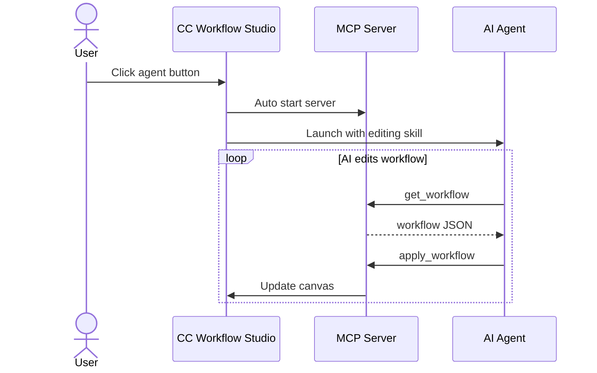
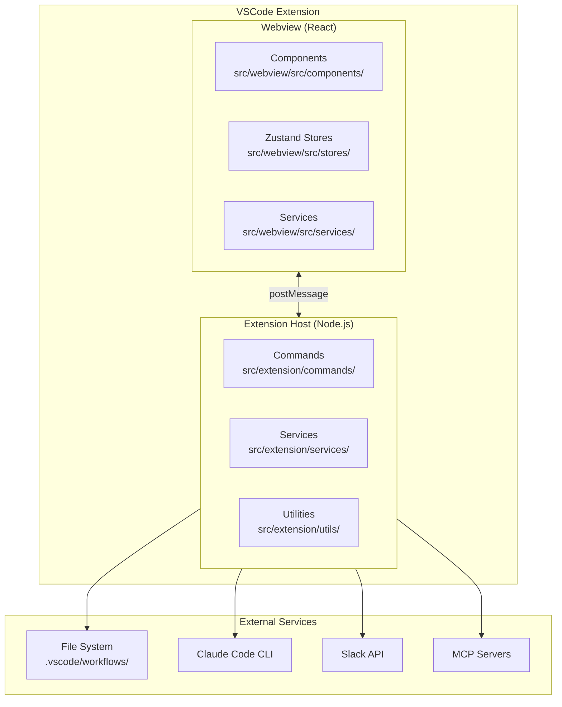
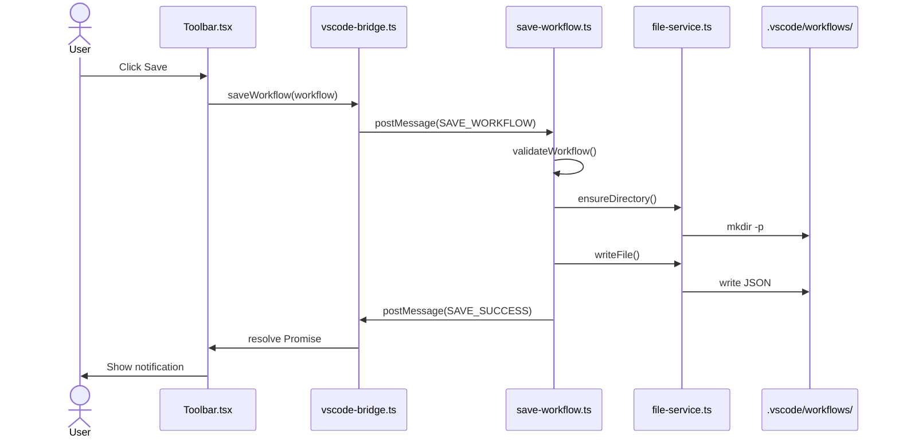
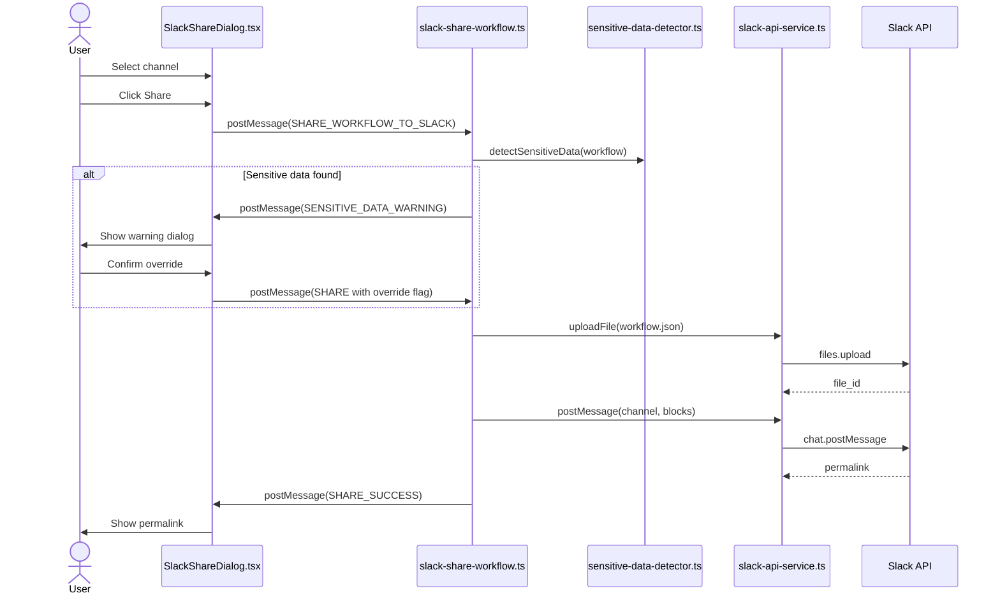
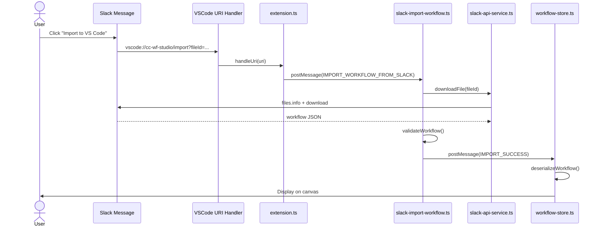
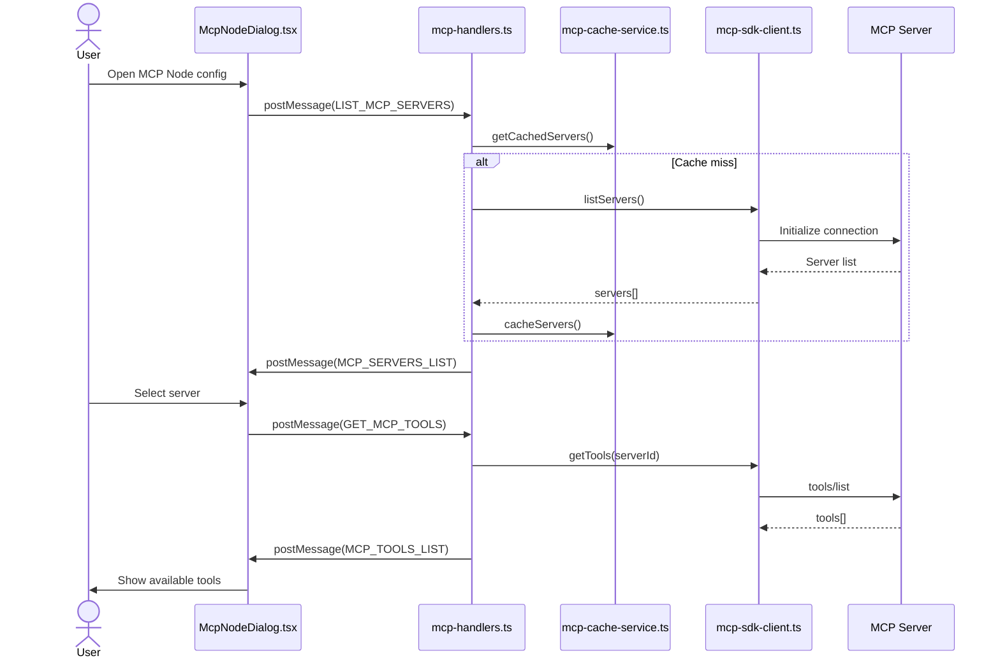

# cc-wf-studio Development Guidelines

Auto-generated from all feature plans. Last updated: 2025-11-01

## Active Technologies
- ローカルファイルシステム (`.vscode/workflows/*.json`, `.claude/skills/*.md`, `.claude/commands/*.md`) (001-cc-wf-studio)
- TypeScript 5.3 (VSCode Extension Host), React 18.2 (Webview UI) (001-node-types-extension)
- ローカルファイルシステム (`.vscode/workflows/*.json`) (001-node-types-extension)
- TypeScript 5.3.0 (001-skill-node)
- File system (SKILL.md files in `~/.claude/skills/` and `.claude/skills/`), workflow JSON files in `.vscode/workflows/` (001-skill-node)
- TypeScript 5.3.0 (VSCode Extension Host), TypeScript/React 18.2 (Webview UI) + VSCode Extension API 1.80.0+, React 18.2, React Flow (visual canvas), Zustand (state management), child_process (Claude Code CLI execution) (001-mcp-node)
- Workflow JSON files in `.vscode/workflows/` directory, Claude Code MCP configuration (user/project/enterprise scopes) (001-mcp-node)
- TypeScript 5.3.0 (VSCode Extension Host), TypeScript/React 18.2 (Webview UI) + VSCode Extension API 1.80.0+, React 18.2, React Flow (visual canvas), Zustand (state management), existing MCP SDK client services (001-mcp-natural-language-mode)
- Workflow JSON files in `.vscode/workflows/` directory (extends existing McpNodeData structure) (001-mcp-natural-language-mode)
- TypeScript 5.3 (VSCode Extension Host), React 18.2 (Webview UI), @slack/web-api 7.x, Node.js http (OAuth callback server), VSCode Secret Storage (001-slack-workflow-sharing)
- Workflow JSON files in `.vscode/workflows/` directory, Slack message attachments (workflow storage), VSCode Secret Storage (OAuth tokens) (001-slack-workflow-sharing)

- TypeScript 5.x (VSCode Extension Host), React 18.x (Webview UI) (001-cc-wf-studio)

## Project Structure

```text
src/
tests/
```

## Development Workflow & Commands

### Commit Message Guidelines

**IMPORTANT: Keep commit messages simple for squash merge workflow.**

#### Format
```
<type>: <subject>

<optional body with bullet points>
```

#### Example
```
fix: add missing MCP node definition to workflow schema

- Added 'mcp' to supportedNodeTypes
- Added complete MCP node type definition with field constraints
- Fixes MCP_INVALID_PARAMETERS and MCP_INVALID_MODE validation errors
```

#### Rules
- **Subject**: 50 characters max, imperative mood, no period
- **Body**: 3-5 bullet points max, "what" changed only
- **Details**: Put "why" and "how" in PR description, NOT commit message

#### Types
- `feat:` - New feature (minor version bump)
- `fix:` - Bug fix (patch version bump)
- `improvement:` - Minor enhancement to existing feature (patch version bump)
- `docs:` - Documentation only
- `refactor:` - Code refactoring
- `chore:` - Build/tooling changes

#### What to Avoid
❌ Long explanations (Problem/Solution/Impact sections)
❌ Multiple paragraphs
❌ Code blocks
❌ Test results with checkboxes

✅ Simple 3-5 line summary of changes

### Code Quality Checks (Required Before Commit/PR)

**Always run these commands in the following order after code modifications:**

```bash
npm run format  # Auto-format code with Biome
npm run lint    # Check for linting issues
npm run check   # Run all Biome checks (lint + format verification)
npm run build   # Build extension and webview (verify compilation)
```

### Command Execution Timing

#### During Development
1. **After code modification**:
   ```bash
   npm run format && npm run lint && npm run check
   ```
   - Fixes formatting issues automatically
   - Identifies linting problems
   - Verifies code quality standards

2. **Before manual E2E testing**:
   ```bash
   npm run build
   ```
   - Compiles TypeScript and builds extension
   - Required for testing changes in VSCode

3. **Before git commit**:
   ```bash
   npm run format && npm run lint && npm run check
   ```
   - Ensures all code quality standards are met
   - Prevents committing code with linting/formatting issues

#### Testing
- **Unit/Integration tests**: Not required (manual E2E testing only)
- **Manual E2E testing**: Required for all feature changes and bug fixes
  - Run `npm run build` first
  - Test in VSCode Extension Development Host

## Version Update Procedure

**IMPORTANT: Version updates and releases are fully automated via Semantic Release and GitHub Actions.**

### Automated Release Process

This project uses **Semantic Release** with **GitHub Actions** for fully automated versioning, changelog generation, and publishing.

#### Release Workflow (`.github/workflows/release.yml`)

**Trigger**: Push to `production` branch

**Automated Steps**:
1. **Semantic Release** analyzes commit messages and determines version bump
2. **Version Update**: Updates `package.json`, `src/webview/package.json`, `src/webview/package-lock.json`
3. **Changelog Generation**: Automatically updates `CHANGELOG.md`
4. **Git Commit**: Creates release commit with message `chore(release): ${version} [skip ci]`
5. **GitHub Release**: Creates GitHub release with release notes
6. **VSIX Build**: Builds and packages the extension
7. **VSIX Upload**: Uploads `.vsix` file to GitHub release
8. **Version Sync**: Merges version changes from `production` to `main` branch

#### Commit Message Convention (Conventional Commits)

The version bump is determined by commit message prefixes:

- `feat:` → **Minor** version bump (e.g., 2.0.0 → 2.1.0)
- `fix:` → **Patch** version bump (e.g., 2.1.0 → 2.1.1)
- `improvement:` → **Patch** version bump (minor enhancements to existing features)
- `perf:` → **Patch** version bump
- `revert:` → **Patch** version bump
- **BREAKING CHANGE** in commit body → **Major** version bump (e.g., 2.1.0 → 3.0.0)
- `docs:`, `style:`, `chore:`, `refactor:`, `test:`, `build:`, `ci:` → No release

**Example commit messages**:
```bash
feat: add MCP node integration
fix: resolve parameter validation issue
feat!: redesign workflow export format (BREAKING CHANGE)
```

#### Changelog Sections (`.releaserc.json`)

Generated changelog groups commits by type:

- **Features** (`feat:`)
- **Bug Fixes** (`fix:`)
- **Improvements** (`improvement:`)
- **Performance Improvements** (`perf:`)
- **Reverts** (`revert:`)
- **Code Refactoring** (`refactor:`) - visible
- **Documentation** (`docs:`) - visible
- **Styles** (`style:`) - hidden
- **Tests** (`test:`) - hidden
- **Build System** (`build:`) - hidden
- **Continuous Integration** (`ci:`) - hidden
- **Miscellaneous Chores** (`chore:`) - hidden

#### Automated File Updates

Semantic Release automatically updates:
- `package.json` (root)
- `src/webview/package.json`
- `src/webview/package-lock.json`
- `CHANGELOG.md`

These files are committed with `[skip ci]` to prevent infinite loops.

#### Manual Version Updates (NOT RECOMMENDED)

**DO NOT manually update version numbers unless absolutely necessary.**

If manual update is required:
1. Update `package.json` (root directory) - `"version"` field
2. Update `src/webview/package.json` - `"version"` field
3. Run `cd src/webview && npm install` to update `package-lock.json`
4. Commit all three files together

Manual version updates will be overwritten by the next automated release.

## Code Style

TypeScript 5.x (VSCode Extension Host), React 18.x (Webview UI): Follow standard conventions

## Recent Changes
- 001-mcp-natural-language-mode: Added TypeScript 5.3.0 (VSCode Extension Host), TypeScript/React 18.2 (Webview UI) + VSCode Extension API 1.80.0+, React 18.2, React Flow (visual canvas), Zustand (state management), existing MCP SDK client services
- 001-mcp-node: Added TypeScript 5.3.0 (VSCode Extension Host), TypeScript/React 18.2 (Webview UI) + VSCode Extension API 1.80.0+, React 18.2, React Flow (visual canvas), Zustand (state management), child_process (Claude Code CLI execution)


<!-- MANUAL ADDITIONS START -->

## AI Editing Features

### MCP Server-based AI Editing (Active)
- The built-in MCP server (`cc-workflow-ai-editor` skill) is the primary interface for external AI agents to create and edit workflows.
- All new AI editing development should go through the MCP server approach.



### Chat UI-based AI Editing (Discontinued)
- The chat UI-based AI editing features (Refinement Chat Panel, AI Workflow Generation Dialog) are **no longer under active development**.
- Existing functionality will be maintained but no new features or enhancements will be added.
- Affected features:
  - `001-ai-workflow-generation`: AI Workflow Generation via AiGenerationDialog
  - `001-ai-workflow-refinement`: AI Workflow Refinement via RefinementChatPanel
  - `001-ai-skill-generation`: AI Skill Node Generation via AiGenerationDialog

## Architecture Sequence Diagrams

このセクションでは、cc-wf-studioの主要なデータフローをMermaid形式のシーケンス図で説明します。

### アーキテクチャ概要



### ワークフロー保存フロー



### Slack ワークフロー共有フロー



### Slack ワークフローインポートフロー (Deep Link)



### MCP サーバー/ツール取得フロー



---

## Dialog Component Design Guidelines

### ライブラリ選択

**Radix UI Dialog を使用すること（必須）**

新規ダイアログは必ず `@radix-ui/react-dialog` を使用する。既存のカスタム実装ダイアログは段階的に Radix UI へ移行する。

**理由:**
- アクセシビリティ（ARIA属性、フォーカス管理）が自動的に処理される
- ESCキー、オーバーレイクリックなどの標準動作が統一される
- z-index管理が容易

### z-index 階層設計（3層構造）

```
レイヤー        z-index   用途
─────────────────────────────────────────────────────
Base           9999      単独ダイアログ、親ダイアログ
Nested         10000     ネストされた子ダイアログ
Confirm        10001     確認ダイアログ（最優先）
```

| z-index | 用途 | 例 |
|---------|------|-----|
| **9999** | 単独ダイアログ、親ダイアログ | McpNodeDialog, SkillBrowserDialog, SlackShareDialog |
| **10000** | ネストされた子ダイアログ | SkillCreationDialog（SkillBrowserDialog内）, TermsOfUseDialog |
| **10001** | 確認・警告ダイアログ | ConfirmDialog（削除確認など） |

### 実装パターン

#### 基本構造（Radix UI Dialog）

```tsx
import * as Dialog from '@radix-ui/react-dialog';

// z-index定数（推奨: 共通定数ファイルで管理）
const Z_INDEX = {
  DIALOG_BASE: 9999,
  DIALOG_NESTED: 10000,
  DIALOG_CONFIRM: 10001,
} as const;

export function MyDialog({ isOpen, onClose }: Props) {
  return (
    <Dialog.Root open={isOpen} onOpenChange={(open) => !open && onClose()}>
      <Dialog.Portal>
        <Dialog.Overlay
          style={{
            position: 'fixed',
            inset: 0,
            backgroundColor: 'rgba(0, 0, 0, 0.5)',
            display: 'flex',
            alignItems: 'center',
            justifyContent: 'center',
            zIndex: Z_INDEX.DIALOG_BASE, // ← 必ず設定
          }}
        >
          <Dialog.Content>
            {/* コンテンツ */}
          </Dialog.Content>
        </Dialog.Overlay>
      </Dialog.Portal>
    </Dialog.Root>
  );
}
```

#### ネストダイアログのパターン

親ダイアログ内で子ダイアログを開く場合:

```tsx
// 親ダイアログ: z-index 9999
<SkillBrowserDialog>
  {/* 子ダイアログ: z-index 10000 */}
  <SkillCreationDialog />
</SkillBrowserDialog>
```

### チェックリスト（新規ダイアログ作成時）

- [ ] `@radix-ui/react-dialog` を使用している
- [ ] `Dialog.Overlay` に `zIndex` を設定している
- [ ] z-index値が階層設計に従っている
  - 単独/親ダイアログ → 9999
  - ネストされる子ダイアログ → 10000
  - 確認ダイアログ → 10001
- [ ] ESCキーでの閉じる動作が正しく機能する
- [ ] オーバーレイクリックでの閉じる動作が正しく機能する

### 現在のダイアログ一覧と状態

全てのダイアログが Radix UI Dialog を使用し、z-index階層設計に準拠しています。

| ダイアログ | z-index | 役割 | 状態 |
|-----------|---------|------|------|
| ConfirmDialog | 10001 | 確認ダイアログ | ✅ |
| SkillCreationDialog | 10000 | 子ダイアログ | ✅ |
| SlackManualTokenDialog | 10000 | 子ダイアログ | ✅ |
| TermsOfUseDialog | 10000 | 単独（優先表示） | ✅ |
| SkillBrowserDialog | 9999 | 親ダイアログ | ✅ |
| McpNodeDialog | 9999 | 単独 | ✅ |
| SubAgentFlowDialog | 9999 | 親ダイアログ | ✅ |
| SlackShareDialog | 9999 | 親ダイアログ | ✅ |
| SlackConnectionRequiredDialog | 9999 | 単独 | ✅ |
| McpNodeEditDialog | 9999 | 単独 | ✅ |

<!-- MANUAL ADDITIONS END -->
