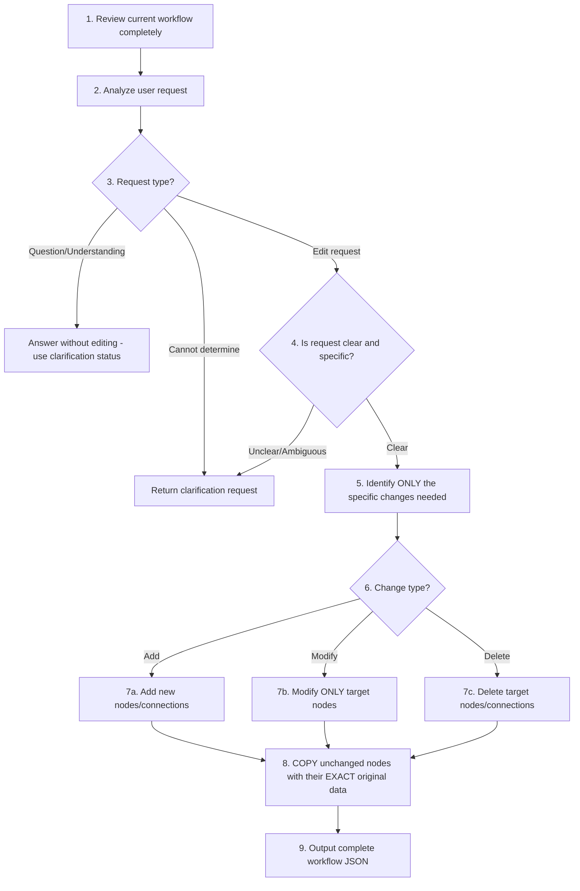

# AI Editing Process Flow

This file defines the AI editing process flow for workflow refinement.
It is used by the `generate-editing-flow.ts` script to generate TypeScript constants.

## Mermaid Diagram

## Process Steps

1. Review current workflow: Understand ALL existing nodes and their data fields completely
2. Analyze user request: Identify what the user wants
3. Request type check: Is this a question/understanding request OR an edit request?
4. Clarity check: If edit request is vague or ambiguous, return clarification
5. Identify changes: List ONLY the specific nodes/connections that need modification
6. Determine change type: Categorize as add, modify, or delete operation
7. Apply minimal changes: Execute ONLY the identified changes
8. Preserve unchanged: COPY ALL unchanged nodes with their EXACT original data field
9. Output: Return the complete workflow with changes applied

## Request Type Guidelines

### Question or Understanding Request

- Questions starting with "What", "Why", "How", "Explain", "Tell me"
- Requests for explanation or clarification about the workflow
- No action verbs like "add", "modify", "delete", "change", "update", "remove"
- Response: Use `{ status: "clarification", message: "your answer" }`

### Edit Request

- Contains action verbs: "add", "modify", "delete", "change", "update", "remove", "insert"
- Specifies target node or location
- Describes desired outcome or new content
- Response: Process through steps 4-9, then use `{ status: "success", ... }`

### Unclear Request

- Vague instructions like "improve", "make better", "fix", "optimize"
- Missing target specification (which node? where?)
- Ambiguous or multiple interpretations possible
- Response: Use `{ status: "clarification", message: "ask for details" }`

## Clarification Triggers

- User request does not specify which node to modify
- User request is ambiguous about the desired outcome
- Multiple valid interpretations exist for the request
- Required information (node name, position, content) is missing
- User request conflicts with existing workflow structure
