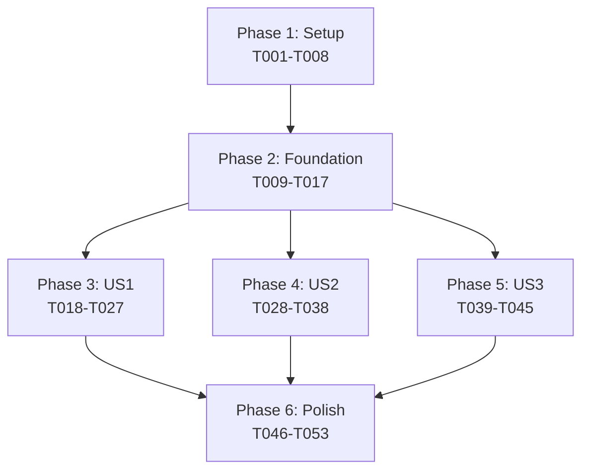

# MCP Node Integration - 実装タスクリスト

**Feature**: 001-mcp-node
**Branch**: feature/001-mcp-node
**Date**: 2024-11-15
**Spec**: specs/001-mcp-node/spec.md
**Plan**: [specs/001-mcp-node/plan.md](./plan.md)

## 進捗管理

**重要**: タスク完了時は、`- [ ]` を `- [x]` に変更してマークしてください。

例:
```markdown
- [ ] T001 未完了のタスク
- [x] T002 完了したタスク
```

これにより、実装の進捗を可視化できます。

## Phase 1: セットアップ (Setup) - 2日

プロジェクトの基盤構造とビルド環境の準備

- [ ] T001 [P] 機能ブランチ feature/001-mcp-node を作成
- [ ] T002 [P] 型定義ファイル src/types/mcp-node.ts を作成
- [ ] T003 [P] MCPノード用ディレクトリ src/extension/nodes/mcp/ を作成
- [ ] T004 [P] Webview用MCPコンポーネントディレクトリ src/webview/src/components/nodes/McpNode/ を作成
- [ ] T005 package.json に child_process 型定義を追加（既存の場合はスキップ）
- [ ] T006 contracts/mcp-cli.schema.json をプロジェクトに配置
- [ ] T007 contracts/workflow-mcp-node.schema.json をプロジェクトに配置
- [ ] T008 contracts/extension-webview-messages.schema.json をプロジェクトに配置

## Phase 2: 基盤実装 (Foundational) - 3日

全ユーザーストーリーの前提となる共通基盤の実装

- [ ] T009 McpNode型定義を実装 in src/types/mcp-node.ts
- [ ] T010 McpNodeData型定義を実装 in src/types/mcp-node.ts
- [ ] T011 McpServerReference型定義を実装 in src/types/mcp-node.ts
- [ ] T012 McpToolReference型定義を実装 in src/types/mcp-node.ts
- [ ] T013 ToolParameter型定義を実装 in src/types/mcp-node.ts
- [ ] T014 MCP CLIラッパークラスを実装 in src/extension/services/mcp-cli-service.ts
- [ ] T015 MCPサーバー情報キャッシュ機構を実装 in src/extension/services/mcp-cache-service.ts
- [ ] T016 Extension-Webview間メッセージ型を定義 in src/types/messages/mcp-messages.ts
- [ ] T017 ワークフロー検証ルールを拡張（MCPノード対応） in src/extension/utils/validate-workflow.ts

## Phase 3: ユーザーストーリー1実装 (US1: MCP Tool Discovery) - 5日

**ストーリーゴール**: ユーザーがMCPツールを検索・選択できる

**独立テスト基準**:
- MCP CLIコマンドが実行され、ツールリストが表示される
- ツール検索・フィルタリングが動作する
- 選択したツールでMCPノードが作成される

- [ ] T018 [US1] MCP_LIST_SERVERSメッセージハンドラを実装 in src/extension/commands/mcp-handlers.ts
- [ ] T019 [US1] MCP_LIST_TOOLSメッセージハンドラを実装 in src/extension/commands/mcp-handlers.ts
- [ ] T020 [US1] listServers()メソッドを実装（claude mcp list実行） in src/extension/services/mcp-cli-service.ts
- [ ] T021 [US1] listTools()メソッドを実装（claude mcp list-tools実行） in src/extension/services/mcp-cli-service.ts
- [ ] T022 [US1] MCPサーバーリストUIコンポーネントを実装 in src/webview/src/components/mcp/McpServerList.tsx
- [ ] T023 [US1] MCPツールリストUIコンポーネントを実装 in src/webview/src/components/mcp/McpToolList.tsx
- [ ] T024 [US1] ツール検索・フィルタリング機能を実装 in src/webview/src/components/mcp/McpToolSearch.tsx
- [ ] T025 [US1] MCPノード作成ダイアログを実装 in src/webview/src/components/dialogs/McpNodeDialog.tsx
- [ ] T026 [US1] workflow-storeにMCPノード追加アクションを実装 in src/webview/src/stores/workflow-store.ts
- [ ] T027 [US1] MCPノードのReact Flowカスタムノードを実装 in src/webview/src/components/nodes/McpNode/McpNode.tsx

## Phase 4: ユーザーストーリー2実装 (US2: Parameter Configuration) - 4日

**ストーリーゴール**: ユーザーがMCPツールのパラメータを設定できる

**独立テスト基準**:
- パラメータスキーマが正しく取得される
- 動的フォームが生成され、バリデーションが動作する
- パラメータ値が保存・復元される

- [ ] T028 [US2] MCP_GET_TOOL_SCHEMAメッセージハンドラを実装 in src/extension/commands/mcp-handlers.ts
- [ ] T029 [US2] getToolSchema()メソッドを実装 in src/extension/services/mcp-cli-service.ts
- [ ] T030 [US2] JSON Schemaパーサーを実装 in src/extension/utils/schema-parser.ts
- [ ] T031 [US2] パラメータフォーム生成器を実装 in src/webview/src/components/mcp/ParameterFormGenerator.tsx
- [ ] T032 [US2] 文字列型パラメータ入力コンポーネントを実装 in src/webview/src/components/mcp/parameters/StringParameter.tsx
- [ ] T033 [US2] 数値型パラメータ入力コンポーネントを実装 in src/webview/src/components/mcp/parameters/NumberParameter.tsx
- [ ] T034 [US2] ブール型パラメータ入力コンポーネントを実装 in src/webview/src/components/mcp/parameters/BooleanParameter.tsx
- [ ] T035 [US2] 配列型パラメータ入力コンポーネントを実装 in src/webview/src/components/mcp/parameters/ArrayParameter.tsx
- [ ] T036 [US2] オブジェクト型パラメータ入力コンポーネントを実装 in src/webview/src/components/mcp/parameters/ObjectParameter.tsx
- [ ] T037 [US2] パラメータバリデーション機能を実装 in src/webview/src/utils/parameter-validator.ts
- [ ] T038 [US2] MCPノード編集ダイアログを実装 in src/webview/src/components/dialogs/McpNodeEditDialog.tsx

## Phase 5: ユーザーストーリー3実装 (US3: Workflow Integration) - 3日

**ストーリーゴール**: MCPノードを含むワークフローを実行できる

**独立テスト基準**:
- MCPノードがワークフローJSONに正しくシリアライズされる
- ワークフロー実行時にMCPツールが呼び出される
- 実行結果がコンソールに表示される

- [ ] T039 [US3] MCPノードのシリアライズ処理を実装 in src/extension/utils/workflow-serializer.ts
- [ ] T040 [US3] MCPノードのデシリアライズ処理を実装 in src/extension/utils/workflow-deserializer.ts
- [ ] T041 [US3] ワークフロー実行時のMCPノード処理を実装 in src/extension/services/workflow-executor.ts
- [ ] T042 [US3] executeTool()メソッドを実装（claude mcp run実行） in src/extension/services/mcp-cli-service.ts
- [ ] T043 [US3] MCP実行結果のパース処理を実装 in src/extension/utils/mcp-result-parser.ts
- [ ] T044 [US3] MCPノードの実行状態表示を実装 in src/webview/src/components/nodes/McpNode/McpNodeStatus.tsx
- [ ] T045 [US3] ワークフロー保存時のMCPノード検証を実装 in src/extension/utils/validate-mcp-workflow.ts

## Phase 6: 仕上げと横断的関心事 (Polish & Cross-Cutting) - 2日

最終統合、ドキュメント化、エラーハンドリング

- [ ] T046 [P] MCPノードのアイコンとスタイリングを実装 in src/webview/src/components/nodes/McpNode/McpNode.css
- [ ] T047 [P] MCPエラーメッセージの国際化対応を追加 in src/webview/src/i18n/locales/*/mcp.json
- [ ] T048 エラーハンドリングとリトライ機構を実装 in src/extension/services/mcp-cli-service.ts
- [ ] T049 MCPノードのツールチップとヘルプテキストを実装 in src/webview/src/components/nodes/McpNode/McpNodeHelp.tsx
- [ ] T050 MCP実行ログをVSCode Output Channelに出力 in src/extension/services/mcp-logger.ts
- [ ] T051 ワークフローテンプレートにMCPノード例を追加 in resources/workflow-templates/mcp-example.json
- [ ] T052 README.mdにMCPノード機能の説明を追加 in README.md
- [ ] T053 CHANGELOG.mdにMCPノード機能を記載 in CHANGELOG.md

## 依存関係 (Dependencies)



### 並列実行可能タスク

**Phase 1 (Setup)**:
- T001-T004は完全並列実行可能

**Phase 3 (US1)**:
- T022-T024（UIコンポーネント）は並列開発可能

**Phase 4 (US2)**:
- T032-T036（パラメータコンポーネント）は並列開発可能

**Phase 6 (Polish)**:
- T046-T047は並列実行可能

## 実装戦略 (Implementation Strategy)

### MVP優先アプローチ

**MVPスコープ（Phase 1-3）**:
- 基本的なMCPツール検索と選択機能
- シンプルなMCPノード作成
- 最小限のUI実装

**段階的デリバリー**:
1. **Week 1**: Setup + Foundation (T001-T017)
2. **Week 2**: US1実装でMVP完成 (T018-T027)
3. **Week 3**: US2実装でパラメータ設定追加 (T028-T038)
4. **Week 4**: US3実装でワークフロー統合 (T039-T045)
5. **Week 5**: Polish & 最終調整 (T046-T053)

### リスク軽減策

1. **MCP CLI依存性**: T014で早期にCLI接続を検証
2. **パフォーマンス**: T015でキャッシュ機構を早期実装
3. **UI複雑性**: Phase 3で最小限UIから始め、段階的に機能追加

### 成功指標

- [ ] MVPリリース: Phase 3完了時点
- [ ] フル機能リリース: Phase 5完了時点
- [ ] ユーザー満足度: Phase 6のPolish完了後

---

**注記**: このタスクリストは実装の進捗に応じて更新されます。各タスクの完了時には、チェックボックスをマークし、必要に応じて新たな課題や改善点を追記してください。